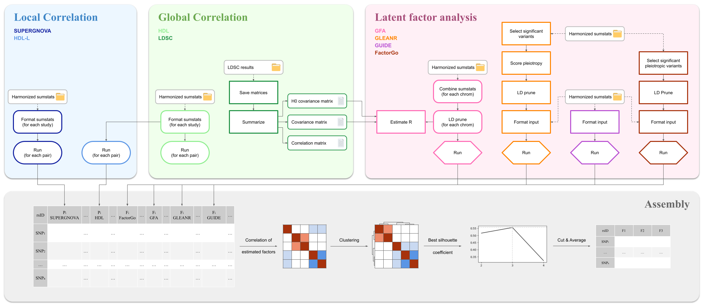

# Pleiotropy Decomposition Pipeline using GWAS summary statistics



## Methods

This pipeline will compute results for a total of **8 methods**:

* **Global correlation methods:**
    * LDSC ([Bulik-Sullivan et al. 2015](https://pubmed.ncbi.nlm.nih.gov/25642630/), [Github repo](https://github.com/bulik/ldsc))
    * HDL ([Ning et al. 2020](https://pubmed.ncbi.nlm.nih.gov/32601477/), [Github repo](https://github.com/zhenin/HDL))
* **Local correlation methods:**
    * SUPERGNOVA ([Zhang et al. 2021](https://pubmed.ncbi.nlm.nih.gov/34493297/), [Github repo](https://github.com/qlu-lab/SUPERGNOVA))
    * HDL-L ([Li et al. 2025](https://pubmed.ncbi.nlm.nih.gov/40065165/), [Github repo](https://github.com/zhenin/HDL))
* **Latent factor analysis methods:**
    * FactorGo ([Zhang et al. 2023](https://pubmed.ncbi.nlm.nih.gov/37879338/), [Github repo](https://github.com/mancusolab/FactorGo))
    * GFA ([Morrison et al. Preprint](https://www.researchsquare.com/article/rs-4714610/v1), [Github repo](https://github.com/jean997/GFA))
    * GLEANR  ([Omdahl et al. 2025](https://pubmed.ncbi.nlm.nih.gov/40730164/), [Github repo](https://github.com/aomdahl/gleanr))
    * GUIDE ([Lazarev et al. Preprint](https://pubmed.ncbi.nlm.nih.gov/38766146/), [Github repo](https://github.com/daniel-lazarev/GUIDE))

!!! info
    More information on the methods can be found in the [*Implemented methods*](methods.md) page.

## Installation

```bash
# Download with https
git clone https://github.com/gloriabenoit/pleiotropy_decomposition.git
# or ssh
git clone git@github.com:gloriabenoit/pleiotropy_decomposition.git

cd pleiotropy_decomposition
```

## Usage

The pipeline is written using Snakemake `8.25.5` (which needs `Python/3.11.5`) and is meant to be run on a HPC cluster which uses environment modules (`module load` command).
We will load `Python/3.13.2` and `Python/3.8.18`, `R/4.4.0` and `plink/1.90p`. The pipeline also depends on the use of multiple virtual environment.

!!! info
    More information on the virtual environments and the package versions can be found in the [*Implemented methods*](methods.md) and [*Dependencies*](dependencies.md) pages.

The pipeline can easily be launched through the use of the following bash script.

```bash
sh run_pdp.sh
```
